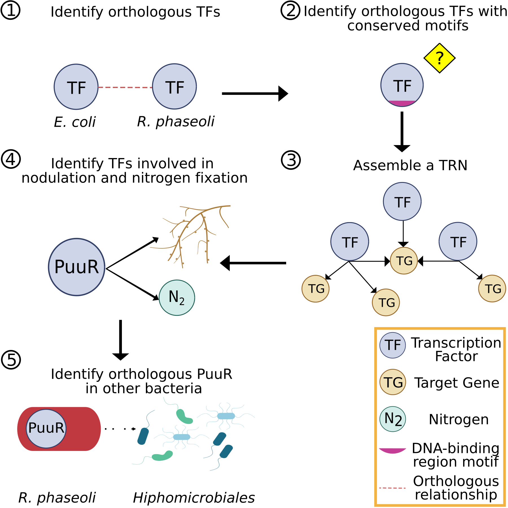

README
================

-   [Putrescine acts as a signaling metabolite in the transition from
    nodulation to nitrogen fixation in *Rhizobium
    phaseoli*](#putrescine-acts-as-a-signaling-metabolite-in-the-transition-from-nodulation-to-nitrogen-fixation-in-rhizobium-phaseoli)
    -   [Project structure](#project-structure)
    -   [Pipeline Overview](#pipeline-overview)
    -   [References](#references)

# Putrescine acts as a signaling metabolite in the transition from nodulation to nitrogen fixation in *Rhizobium phaseoli*

Welcome! This repository contains a series of analysis that provide new
insights into the molecular cross-talk between *Phaseolus vulgaris* and
*Rhizobium phaseoli*, which is crucial for the development of
alternative cropping strategies, including biopesticides and
biofertilizers (Syed Ab Rahman et al. 2018). In addition, we present a
transcriptional regulatory network systematically assembled for
*Rhizobium phaseoli*, which opens new avenues of research in the
relationship between the transcriptional regulation and metabolism of
these organisms.

## Project structure

    ## .
    ## |-- 1_BBH_TFs/
    ## |-- 2_MotifConservation/
    ## |-- 3_TRN/
    ## |-- 4_Evidence_Levels/
    ## |-- 5_BBH_PuuR/
    ## 5 directories

The repository contains the following folders:

-   `1_BBH_TFs`: Contains binary files (.R, .sh. and .py) and formatted
    files (.tsv) **to identify orthologous genes and orthologous
    Transcription Factors (TFs)** between *R. phaseoli* and *E. coli*.

-   `2_MotifConservation`: Contains binary files (.R, .sh. and .py) and
    formatted files (.tsv) **to identify orthologous TFs with conserved
    motifs** (e.g. DNA-binding region motif) in *R. phaseoli*.

-   `3_TRN`: Contains binary files (.R, .sh. and .py) and formatted
    files (.tsv) **to assemble a Transcriptional Regulatory Netwotk
    (TRN) for *R. phaseoli*** from orthologous TFs.

-   `4_Evidence_Levels`: Contains binary files (.R, .sh. and .py) and
    formatted files (.tsv) **to identify TFs regulating genes involved
    in the symbiosis process**.

-   `5_BBH_PuuR`: Contains binary files (.R, .sh. and .py) and formatted
    files (.tsv) **to identify orthologous sequences of *R. phaseoli*
    PuuR in seven bacteria** of the *Hyphomicrobiales* order.

## Pipeline Overview

The pipeline consist of five main steps (**Figure 1**), each one
associated with a folder. First, we identified orthologous TFs based on
sequence conservation. Then, identified orthologous TFs with a
DNA-binding motif conserved to assemble a TRN. Next, we identified TFs
involved in nodulation or nitrogen fixation, being PuuR the most
reliable one. Finally, to further support the functional relevance of
PuuR in symbiosis we evaluated its conservation among rhizobia and other
closely-related bacteria.

Figure 1. Pipeline Overview

## References

Syed Ab Rahman, Sharifah Farhana, Eugenie Singh, Corné M J Pieterse, and
Peer M Schenk. 2018. “Emerging Microbial Biocontrol Strategies for Plant
Pathogens.” *Plant Science* 267 (February): 102–11.
<https://doi.org/10.1016/j.plantsci.2017.11.012>.

